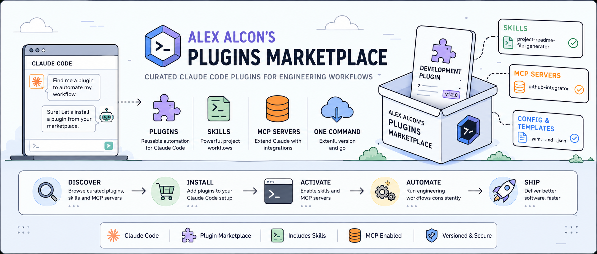

<!-- ────────────────────────────── -->
<!-- header: project logo or banner -->
<!-- ────────────────────────────── -->
<p align="center" id="banner">
  <a href="https://github.com/alexalcon/alexalcon-plugins-marketplace">
    
    <!--  -->
  </a>
</p>

<!-- ───────────────────────────────────────────────────────────────── -->
<!-- header: project title, one line description, links and dev badges -->
<!-- ───────────────────────────────────────────────────────────────── -->
<h1 align="center">Alex Alcon's Plugins Marketplace</h1>

<div align="center">
  <p>
    A curated marketplace of Claude Code plugins for personal development workflows.
    <br>
    <br>
    <!-- project informational links and badges -->
    <a href="./CHANGELOG.md">Changelog</a>
    ·
    <a href="https://github.com/alexalcon/alexalcon-plugins-marketplace/issues/new?assignees=&labels=bug&template=01_BUG_REPORT.md&title=bug%3A+">Report a Bug</a>
    ·
    <a href="https://github.com/alexalcon/alexalcon-plugins-marketplace/issues/new?assignees=&labels=enhancement&template=02_FEATURE_REQUEST.md&title=feat%3A+">Request a Feature</a>
    ·
    <a href="https://github.com/alexalcon/alexalcon-plugins-marketplace/issues/new?assignees=&labels=question&template=04_SUPPORT_QUESTION.md&title=support%3A+">Ask a Question</a>
  </p>

  [](LICENSE)
  [](https://github.com/alexalcon/alexalcon-plugins-marketplace/issues?q=is%3Aissue+is%3Aopen+label%3A%22help+wanted%22)
</div>

<br>

<!-- ────────────────────── -->
<!-- header: feature badges -->
<!-- ────────────────────── -->
<div align="center">

  [](https://docs.claude.com/en/docs/claude-code/overview)
  [](https://docs.claude.com/en/docs/claude-code/plugin-marketplaces)
  [](https://docs.claude.com/en/docs/claude-code/skills)
  [](https://modelcontextprotocol.io)

</div>

<!-- ──────────────────────────────────────── -->
<!-- header: detailed synopses of the project -->
<!-- ──────────────────────────────────────── -->
<div align="center">
  <p align="center">
  <strong>Alex Alcon's Plugins Marketplace</strong> is a personal, versioned catalog of Claude Code plugins that package recurring engineering workflows into reusable, well-documented skills.
  </p>
  <p align="center">
  It bundles configuration, MCP servers, and skills (such as an interactive README generator) behind a single Claude Code plugin marketplace manifest, so they can be installed, versioned, and shared with a single command.
  </p>
  <p align="center">
  The project exists to turn one-off automation scripts and prompts into durable, discoverable tooling: instead of re-writing the same Claude Code workflows project after project, they live here once and travel with whichever repository needs them.

  This <a href="./README.md">README.md</a> file was generated by the <a href="./plugins/alexalcon-development-plugin/">`alexalcon-development-plugin`</a> using the <a href="./plugins/alexalcon-development-plugin/skills/project-readme-file-generator/">`project-readme-file-generator`</a> skill, which is included in this marketplace. 
  </p>
</div>

<!-- ─────────────────────────────────────────────────────── -->
<!-- header: screenshot gif that shows how the project works -->
<!-- ─────────────────────────────────────────────────────── -->
<div align="center">
  <a>
    
  </a>  
</div>

<!-- ───────────────────────── -->
<!-- header: table of contents -->
<!-- ───────────────────────── -->
## Table of Contents <!-- all fields are mandatory -->
<!-- body -->
- [About](#about)
  - [Built With](#built-with)
- [Getting Started](#getting-started)
  - [Prerequisites](#prerequisites)
  - [Installation](#installation)
  - [Usage](#usage)
- [Roadmap](#roadmap)
- [Support](#support)
- [Project assistance](#project-assistance)
- [Contributing](#contributing) <!-- footer -->
- [Authors & contributors](#authors--contributors) <!-- footer -->
- [Security](#security) <!-- footer -->
- [License](#license) <!-- footer -->

---

<!-- ─────────────────────────────────────────── -->
<!-- body and footer: table of contents sections -->
<!-- ─────────────────────────────────────────── -->
## About <!-- the project description (referencial framework) -->

Working across multiple repositories with Claude Code surfaces the same needs again and again, such as a well-structured README, a consistent `CONTRIBUTING`/`SECURITY` setup, and a project-specific automation skill, yet each of these is usually rebuilt from scratch or copy-pasted between projects. This marketplace collects that recurring tooling into one place: a set of installable Claude Code plugins, each bundling the skills, MCP servers, and configuration needed to reproduce a specific workflow on demand.

Claude Code supports custom skills and plugins, but without a central, versioned home for them, personal automations tend to drift: a skill written for one project rarely makes it, unmodified, into the next, and there is no single point from which to install, update, or audit them. The lack of a personal plugin registry means valuable workflow logic (such as generating a consistent, professional README) has to be reinvented or manually copied each time it is needed.

The general objective of this repository is to provide a personal, versioned Claude Code plugin marketplace that packages recurring development workflows into reusable, installable skills. Specifically, it aims to consolidate personal automation logic into self-contained plugins; expose each plugin through a standard marketplace manifest so it can be installed with the built-in Claude Code plugin mechanism; document every skill clearly enough that it can be picked up, modified, or extended without re-reading its source; and keep the marketplace structured so that new plugins can be added without disrupting existing ones.

Maintaining these workflows as an installable marketplace, rather than as loose scripts or prompts scattered across repositories, saves time on every new project, keeps automation logic under version control, and makes it possible to improve a skill once and have that improvement available everywhere it is used. It also serves as a working reference for how Claude Code plugins, skills, and MCP servers fit together in practice.

This marketplace is scoped to the tooling needed for the <a href="https://github.com/alexalcon"> maintainer's</a> own development workflow rather than for general public distribution, so plugins are added and evolved as new needs arise rather than following a fixed roadmap. At present it hosts a single plugin, `alexalcon-development-plugin`, containing an MCP configuration and a README-generation skill; broader compatibility, testing, and multi-plugin coordination will be addressed incrementally as the marketplace grows.

### Built With <!-- the tech stack -->

- [Claude Code](https://docs.claude.com/en/docs/claude-code/overview): the CLI agent that plugins, skills, and MCP servers are built for.
- [Claude Code Plugin Marketplaces](https://docs.claude.com/en/docs/claude-code/plugin-marketplaces): JSON manifests (`.claude-plugin/marketplace.json`, `plugin.json`) that declare and distribute plugins.
- [Model Context Protocol (MCP)](https://modelcontextprotocol.io): used to connect plugins to external tools and services via `.mcp.json` configuration.
- [Claude Code Skills](https://docs.claude.com/en/docs/claude-code/skills): Markdown-based `SKILL.md` files with supporting templates and reference assets that define reusable, invokable workflows.
- Markdown: the format used for skill instructions, templates, and generated project documentation.

## Getting Started

### Prerequisites

Before installing plugins from this marketplace, make sure you have the following:

- [Claude Code](https://docs.claude.com/en/docs/claude-code/overview) installed and authenticated with an active Claude subscription or API access.
- [Git](https://git-scm.com/) installed, to clone this repository and add it as a marketplace source.
- A [GitHub](https://github.com/) account, to access this repository and its plugins.
- Access to a [Notion](https://www.notion.so/) workspace, if you plan to use the `alexalcon-development-plugin`'s bundled MCP server.
- Working knowledge of Claude Code itself: slash commands, custom commands, configuring and invoking skills, MCP servers, hooks, and similar concepts, since this marketplace assumes familiarity with how Claude Code plugins are used rather than teaching it from scratch.

### Installation

There are two main ways to use the plugins from this marketplace, depending on whether you just want to try one out or install it permanently.

**Option 1: Test a plugin directly, without installing it**

Clone this repository once, anywhere on your machine, for example alongside your other projects:

```bash
git clone https://github.com/alexalcon/alexalcon-plugins-marketplace.git
```

Then, whenever you want to try a plugin, start a Claude Code session from the project or directory where you want to use it, and point the `--plugin-dir` flag at the plugin's folder inside your local clone of this repository. This loads the plugin for that session only, without adding a marketplace or persisting anything to your configuration:

```bash
claude --plugin-dir /path/to/alexalcon-plugins-marketplace/plugins/alexalcon-development-plugin
```

Replace `/path/to/alexalcon-plugins-marketplace` with the actual location where you cloned the repository (an absolute path, or a relative path from your current project).

Once Claude Code starts, try one of the plugin's skills, namespaced under the plugin name:

```
/alexalcon-development-plugin:project-readme-file-generator
```

Before using a plugin, read its own `README.md` file (for example, [plugins/alexalcon-development-plugin/README.md](./plugins/alexalcon-development-plugin/README.md)) to learn how to use it and interact with it, since usage details are documented per plugin rather than in this marketplace-level README.

See [Test your plugin](https://code.claude.com/docs/en/plugins#test-your-plugins-locally) for more details on this workflow.

**Option 2: Add the marketplace and install a plugin**

To install a plugin permanently and receive updates whenever this marketplace changes, add the repository as a marketplace source, then install the plugin you want from it:

```
/plugin marketplace add alexalcon/alexalcon-plugins-marketplace
/plugin install alexalcon-development-plugin@alexalcon-plugins-marketplace
```

Check the install summary: if it reports `Run /reload-plugins to activate.`, run that command to activate the plugin. Afterwards, refresh the marketplace at any time with `/plugin marketplace update` to pull in the latest plugin changes.

See [Add and install](https://code.claude.com/docs/en/plugin-marketplaces#walkthrough-create-a-local-marketplace) for more details on this workflow.


## Usage

To use a specific plugin, check out its corresponding `README.md` file, located under its own directory in [plugins/](./plugins/) (for example, [plugins/alexalcon-development-plugin/README.md](./plugins/alexalcon-development-plugin/README.md)). Each plugin documents its own skills, commands, and usage instructions independently of this marketplace-level README.

## Roadmap

See the [open issues](https://github.com/alexalcon/alexalcon-plugins-marketplace/issues) for a list of proposed features (and known issues).

- [Top Feature Requests](https://github.com/alexalcon/alexalcon-plugins-marketplace/issues?q=label%3Aenhancement+is%3Aopen+sort%3Areactions-%2B1-desc) (Add your votes using the 👍 reaction)
- [Top Bugs](https://github.com/alexalcon/alexalcon-plugins-marketplace/issues?q=is%3Aissue+is%3Aopen+label%3Abug+sort%3Areactions-%2B1-desc) (Add your votes using the 👍 reaction)
- [Newest Bugs](https://github.com/alexalcon/alexalcon-plugins-marketplace/issues?q=is%3Aopen+is%3Aissue+label%3Abug)

## Support

Reach out to the maintainer at one of the following places:

- [GitHub issues](https://github.com/alexalcon/alexalcon-plugins-marketplace/issues/new?assignees=&labels=question&template=04_SUPPORT_QUESTION.md&title=support%3A+)
- Contact options listed on [this GitHub profile](https://github.com/alexalcon)
- [LinkedIn](https://www.linkedin.com/in/alex-alcón)

## Project assistance

If you want to say **thank you** or/and support active development of Alex Alcon's Plugins Marketplace:

- Add a [GitHub Star](https://github.com/alexalcon/alexalcon-plugins-marketplace) to the project.
- Tweet about Alex Alcon's Plugins Marketplace.
- Write interesting articles about the project on [Dev.to](https://dev.to/), [Medium](https://medium.com/) or your personal blog.

Together, we can make Alex Alcon's Plugins Marketplace **better**!

<!-- ────────────────── -->
<!-- footer subsections -->
<!-- ────────────────── -->

## Contributing

First off, thanks for taking the time to contribute! Contributions are what make the open-source community such an amazing place to learn, inspire, and create. Any contributions you make will benefit everybody else and are **greatly appreciated**.


Please read [the contribution guidelines](.github/CONTRIBUTING.md), and thank you for being involved!

## Authors & contributors

The original setup of this repository is by [Alex Alcón](https://github.com/alexalcon).

For a full list of all authors and contributors, see [the contributors page](https://github.com/alexalcon/alexalcon-plugins-marketplace/contributors).

## Security

Alex Alcon's Plugins Marketplace follows good practices of security, but 100% security cannot be assured.
Alex Alcon's Plugins Marketplace is provided **"as is"** without any **warranty**. Use at your own risk.

_For more information and to report security issues, please refer to our [security documentation](.github/SECURITY.md)._

## License

This project is licensed under the **MIT license**.

See [LICENSE](LICENSE) for more information.

## Acknowledgements

This project was inspired by the well defined work of the following open source projects and presentation, which are acknowledged here:

- <a href="https://github.com/dec0dOS/amazing-github-template">Amazing GitHub Template</a>
- <a href="https://github.com/matiassingers/awesome-readme">Awesome Readme</a>
- <a href="https://www.youtube.com/watch?v=vfZuFo1gTB8&list=PLA9_Hq3zhoFw6patag2gZcDjpugDLBStL&index=32">Build a Better README - Jason A. Crome - TPRC 2024</a>

> Give them a star and a like.

The project's <a href="#banner">README</a> banner image was inspired by the design style of <a href="https://bytebytego.com/">ByteByteGo</a>. And also the banner image itself was generated using <a href="https://chatgpt.com/images/">ChatGPT Images 2.0 | AI Image Generator
</a>.