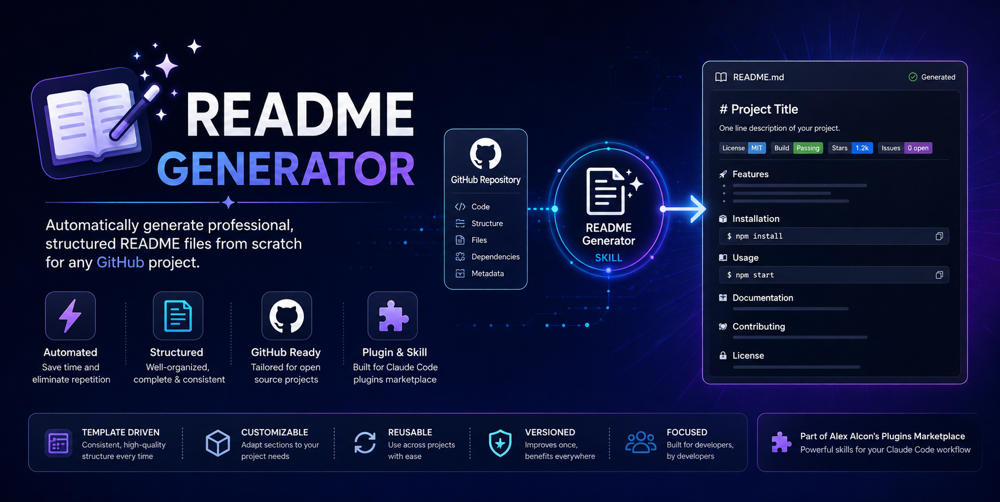
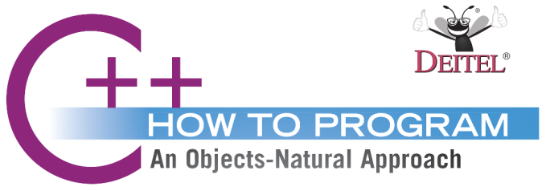

<!-- ────────────────────────────── -->
<!-- header: project logo or banner -->
<!-- ────────────────────────────── -->

  <a href="https://github.com/GITHUB_USERNAME/REPO_SLUG">
    <!-- please provide path to your logo here -->
    
    <!--  -->
  </a>

<!-- ───────────────────────────────────────────────────────────────── -->
<!-- header: project title, one line description, links and dev badges -->
<!-- ───────────────────────────────────────────────────────────────── -->
<h1 align="center">PROJECT NAME</h1>

  

    Short description: A one line summary that says very succinctly “what is this” 
     
    <a href=""><strong>Explore the Docs »</strong></a>
     
     
    <!-- project informational links and badges -->
    <a href="">Project Website</a>
    ·
    <a href="./CHANGELOG.md">Changelog</a>
    .
    <a href="https://github.com/GITHUB_USERNAME/REPO_SLUG/issues/new?assignees=&labels=bug&template=01_BUG_REPORT.md&title=bug%3A+">Report a Bug</a>
    ·
    <a href="https://github.com/GITHUB_USERNAME/REPO_SLUG/issues/new?assignees=&labels=enhancement&template=02_FEATURE_REQUEST.md&title=feat%3A+">Request a Feature</a>
    ·
    <a href="https://github.com/GITHUB_USERNAME/REPO_SLUG/issues/new?assignees=&labels=question&template=04_SUPPORT_QUESTION.md&title=support%3A+">Ask a Question</a>
    <!-- some additional informational links options -->
    <!-- ·
    <a href="https://docs.bestpractical.com/release-notes/rt/index.html">Release Notes</a> -->
    <!-- ·
    <a href="https://forum.bestpractical.com/">Community Forum</a> -->
    <!-- ·
    <a href="https://rt-wiki.bestpractical.com">Public Wiki</a> -->
    <!-- ·
    <a href="https://bestpractical.com/blog/">Blog</a> -->
    <!-- ·
    <a href="https://bestpractical.com/pricing">Hosting & Support</a> -->
    <!--   -->
    <!--   -->
    <!--  -->
    <!--  -->
    <!--   -->
    <!--   -->
  

  
  

 

<!-- ────────────────────── -->
<!-- header: feature badges -->
<!-- ────────────────────── -->

  
  
  
  
  
  [-lightgrey.svg)](https://isocpp.org/std/status)

  &nbsp;
  &nbsp;
  &nbsp;
  

<!-- ──────────────────────────────────────── -->
<!-- header: detailed synopses of the project -->
<!-- ──────────────────────────────────────── -->

  

  A more detailed synopses of the project.
  

  

  A more detailed synopses of the project.
  

  

  A more detailed synopses of the project.
  

<!-- ──────────────────────────────────────────────────────── -->
<!-- header: screenshot gift that shows how the project works -->
<!-- ──────────────────────────────────────────────────────── -->

    

<!-- ───────────────────────── -->
<!-- header: table of contents -->
<!-- ───────────────────────── -->
## Table of Contents <!-- all fields are mandatory -->
<!-- body -->
- [About](#about)
  - [Built With](#built-with)
- [Getting Started](#getting-started)
  - [Prerequisites](#prerequisites)
  - [Installation](#installation)
  - [Usage](#usage)
- [Roadmap](#roadmap)
- [Support](#support)
- [Project assistance](#project-assistance)
<!-- footer -->
- [Contributing](#contributing)
- [Authors & contributors](#authors--contributors)
- [Security](#security)
- [License](#license) 
- [Acknowledgements](#acknowledgements) <!-- if applies -->

---

<!-- ─────────────────────────────────────────── -->
<!-- body and footer: table of contents sections -->
<!-- ─────────────────────────────────────────── -->

## About <!-- the project description (referencial framework) -->

> **[?]**
> Provide general and referencial information about your project here, i.e, an **introduction** to your project.
> What problem does it (intend to) solve?, i.e., **problem approach and statement**.
> What is the purpose of your project?, i.e., **objectives** of the project.
> Why did you undertake it?, i.e., a **justification** of the project.
> **Limitations and scope** explanation.

<!-- optional -->
<!-- let your imagination come up in here -->

<strong>Functionality Screenshots</strong>

Some relevant functionality screenshots of the project:

> **[?]**
> Please provide your screenshots here.

<!-- just add bold title sections instead of a table like below -->
<!-- EDIT THIS -->
**Title** 
---
|                               Home Page                               |                               Login Page                               |
| :-------------------------------------------------------------------: | :--------------------------------------------------------------------: |
|  |  |

### Built With <!-- the tech stack -->

> **[?]**
> Please provide the technologies that are used in the project.

## Getting Started

### Prerequisites

> **[?]**
> What are the project requirements/dependencies?

### Installation

> **[?]**
> Describe how to install and get started with the project.

## Usage

> **[?]**
> How does one go about using it?
> Provide various use cases and code examples here.

<!-- optional for small projects -->
## Roadmap

See the [open issues](https://github.com/GITHUB_USERNAME/REPO_SLUG/issues) for a list of proposed features (and known issues).

- [Top Feature Requests](https://github.com/GITHUB_USERNAME/REPO_SLUG/issues?q=label%3Aenhancement+is%3Aopen+sort%3Areactions-%2B1-desc) (Add your votes using the 👍 reaction)
- [Top Bugs](https://github.com/GITHUB_USERNAME/REPO_SLUG/issues?q=is%3Aissue+is%3Aopen+label%3Abug+sort%3Areactions-%2B1-desc) (Add your votes using the 👍 reaction)
- [Newest Bugs](https://github.com/GITHUB_USERNAME/REPO_SLUG/issues?q=is%3Aopen+is%3Aissue+label%3Abug)

## Support

> **[?]**
> Provide additional ways to contact the project maintainer/maintainers.

Reach out to the maintainer at one of the following places:

- [GitHub issues](https://github.com/GITHUB_USERNAME/REPO_SLUG/issues/new?assignees=&labels=question&template=04_SUPPORT_QUESTION.md&title=support%3A+)
- Contact options listed on [this GitHub profile](https://github.com/GITHUB_USERNAME)

## Project assistance

If you want to say **thank you** or/and support active development of PROJECT_NAME:

- Add a [GitHub Star](https://github.com/GITHUB_USERNAME/REPO_SLUG) to the project.
- Tweet about the PROJECT_NAME.
- Write interesting articles about the project on [Dev.to](https://dev.to/), [Medium](https://medium.com/) or your personal blog.

Together, we can make PROJECT_NAME **better**!

<!-- ────────────────── -->
<!-- footer subsections -->
<!-- ────────────────── -->

## Contributing

First off, thanks for taking the time to contribute! Contributions are what make the open-source community such an amazing place to learn, inspire, and create. Any contributions you make will benefit everybody else and are **greatly appreciated**.

Please read [the contribution guidelines](docs/CONTRIBUTING.md), and thank you for being involved!

## Authors & contributors

The original setup of this repository is by [FULL_NAME](https://github.com/GITHUB_USERNAME).

<!-- this part is optional if no additional authors or contributors -->
For a full list of all authors and contributors, see [the contributors page](https://github.com/GITHUB_USERNAME/REPO_SLUG/contributors).

## Security

PROJECT_NAME follows good practices of security, but 100% security cannot be assured.
PROJECT_NAME is provided **"as is"** without any **warranty**. Use at your own risk.

_For more information and to report security issues, please refer to our [security documentation](docs/SECURITY.md)._

## License

This project is licensed under the **MIT license**.

See [LICENSE](LICENSE) for more information.

## Acknowledgements

> **[?]**
> If your work was funded by any organization or institution, acknowledge their support here.
> In addition, if your work relies on other software libraries, or was inspired by looking at other work, it is appropriate to acknowledge this intellectual debt too.